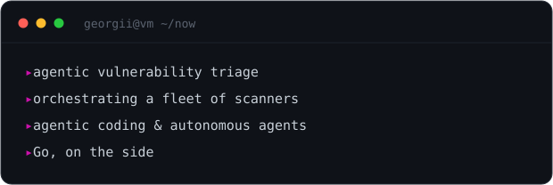

 

&nbsp;

&nbsp;

 

InfraSec engineer doing **Vulnerability Management** at **Wildberries**. 
I turn a firehose of scanner output into signal — and lately I let **agents** do the triage. 
Less dashboards. More automation that thinks. · B.Sc. CS, Innopolis University

  

  

  

&nbsp;

 

<i>"The most dangerous part of any security system is the human operating it."</i>

