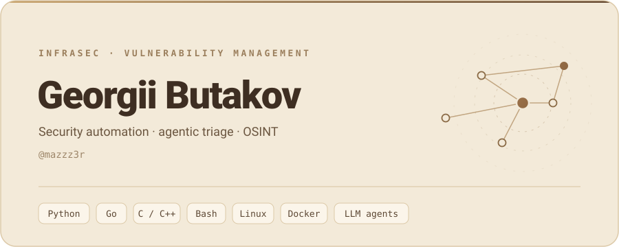

  

  <b>I turn noisy scanner output into signal.</b>

  Agentic triage &amp; security scanners in InfraSec&nbsp;/&nbsp;Vulnerability&nbsp;Management, 
  while finishing my B.Sc. in Computer Science. 
  Lately into <b>agentic coding</b>, autonomous <b>agents</b>, and <b>OSINT</b>.

  
  &nbsp;&nbsp;&nbsp;&nbsp;
  

  <a href="https://t.me/mazzz3r">&nbsp;@mazzz3r</a>
  &nbsp;&nbsp;·&nbsp;&nbsp;
  <a href="mailto:mazzz3r@gmail.com">&nbsp;mazzz3r@gmail.com</a>

